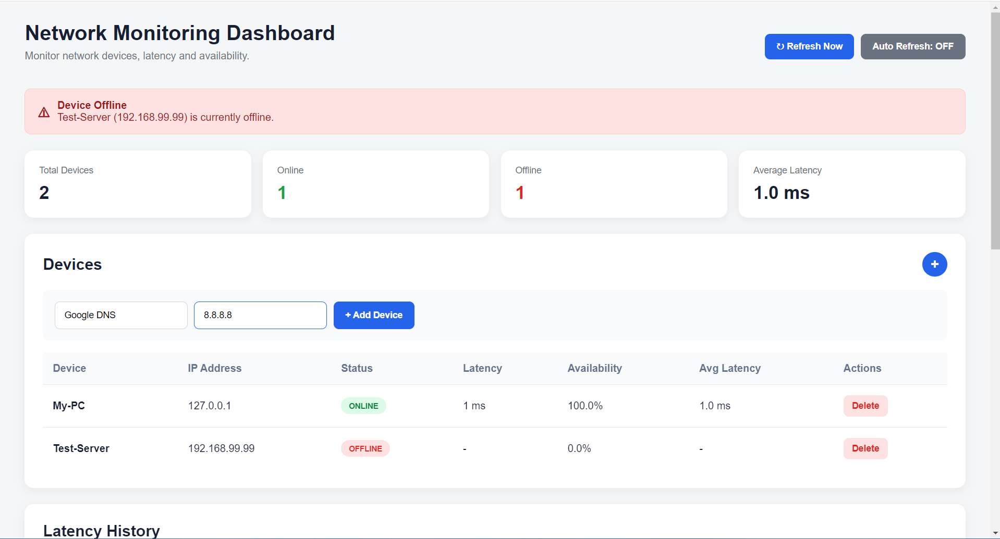
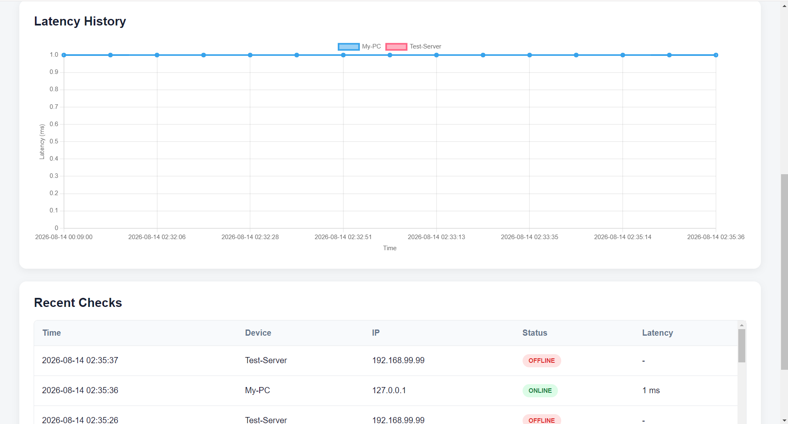

# Network Monitoring Tool

A lightweight network monitoring dashboard built with **Python and Flask** to monitor network devices, measure latency, track availability, maintain historical monitoring data, and provide a simple web-based interface for network visibility.

The project was built as a personal networking/software engineering project to combine practical networking concepts with Python development, backend logic, logging, data processing, and web development.

---

## 📌 Overview

**Network Monitoring Tool** continuously checks configured devices using ICMP ping and presents their current status through a web dashboard.

The application can:

* Monitor multiple devices by IP address
* Detect whether a device is **ONLINE** or **OFFLINE**
* Measure network latency
* Calculate device availability
* Calculate average latency
* Store monitoring history in log files
* Display historical latency data
* Add devices directly from the dashboard
* Remove devices from the dashboard
* Refresh monitoring results manually
* Automatically refresh monitoring results every 10 seconds
* Display alerts when a device is offline
* Provide a visual dashboard for monitoring network health

The project intentionally uses a lightweight architecture so that the core networking concepts remain visible and easy to understand.

---

## 🖥️ Dashboard

The dashboard provides a central view of the monitored network.

It displays:

* Total number of devices
* Online devices
* Offline devices
* Average latency
* Device status
* Current latency
* Availability percentage
* Historical latency
* Offline alerts
* Device management controls

### Dashboard Overview



### Latency History



---

## ⚙️ How It Works

The application follows a simple monitoring pipeline:

```text
Configured Devices
       │
       ▼
   Load Devices
       │
       ▼
     Ping IP
       │
       ├── ONLINE ──► Measure Latency
       │
       └── OFFLINE
       │
       ▼
   Save Monitoring Log
       │
       ▼
 Calculate Statistics
       │
       ▼
 Flask Dashboard
       │
       ▼
 Current Status + History + Alerts
```

Each monitoring cycle performs a network check against every configured device.

The result is then processed by the application and stored in the monitoring history.

---

## 🧩 Project Structure

```text
Network-Monitoring-Tool/
│
├── app.py
│
├── config/
│   └── devices.txt
│
├── logs/
│   └── network_history.log
│
├── screenshots/
│   ├── dashboard-overview.png
│   └── latency-history.png
│
├── src/
│   └── monitor.py
│
├── templates/
│   └── dashboard.html
│
└── README.md
```

### Main Components

#### `app.py`

The Flask backend.

Responsible for:

* Loading configured devices
* Performing monitoring checks
* Processing monitoring results
* Calculating statistics
* Loading historical data
* Passing data to the dashboard
* Handling device management
* Serving the web application

#### `src/monitor.py`

Contains the core monitoring logic used to check network devices and measure connectivity.

#### `config/devices.txt`

Stores the configured devices.

Example:

```text
My-PC,127.0.0.1
Test-Server,192.168.99.99
```

The configuration format is:

```text
Device Name,IP Address
```

#### `logs/network_history.log`

Stores historical monitoring results.

Example:

```text
2026-08-13 22:51:21 | My-PC | 127.0.0.1 | ONLINE | 1ms
2026-08-13 22:51:26 | Test-Server | 192.168.99.99 | OFFLINE
```

#### `templates/dashboard.html`

Contains the web dashboard interface and presentation layer.

---

## 🚀 Features

### 1. Device Monitoring

The application uses network ping to determine whether a device is reachable.

Example:

```text
My-PC (127.0.0.1) -> ONLINE | Latency: 1ms
Test-Server (192.168.99.99) -> OFFLINE
```

---

### 2. Latency Measurement

For reachable devices, the application extracts the ping response time and displays it in milliseconds.

Example:

```text
Latency: 1ms
```

This information is also used to calculate average latency.

---

### 3. Availability Calculation

The application tracks how many monitoring checks resulted in an online state.

For example:

```text
Checks       : 5
Online       : 5
Offline      : 0
Availability : 100.00%
```

An unreachable device can therefore be monitored over time rather than only showing its current state.

---

### 4. Historical Monitoring

Monitoring results are stored in:

```text
logs/network_history.log
```

This allows the dashboard to display previous monitoring results instead of only showing the latest check.

---

### 5. Web Dashboard

The Flask dashboard provides a more practical interface than relying only on terminal output.

The dashboard includes:

* Monitoring statistics
* Device table
* Current status
* Latency
* Availability
* Average latency
* Historical latency chart
* Offline alerts

---

### 6. Device Management

Devices can be added directly from the dashboard.

Instead of manually editing the configuration file, the user can enter:

```text
Device Name
IP Address
```

and add the device.

Devices can also be removed from the dashboard.

---

### 7. Manual Refresh

The dashboard provides a **Refresh Now** option to perform a new monitoring cycle immediately.

---

### 8. Automatic Monitoring

The dashboard can automatically refresh the monitoring results every 10 seconds.

Automatic refresh can also be disabled when continuous monitoring is not required.

---

### 9. Offline Alerts

When a monitored device becomes unreachable, the dashboard displays an alert containing the device name and IP address.

Example:

```text
Device Offline

Test-Server (192.168.99.99) is currently offline.
```

---

## 🛠️ Technologies Used

| Technology         | Purpose                                          |
| ------------------ | ------------------------------------------------ |
| Python             | Core application logic                           |
| Flask              | Web backend and dashboard server                 |
| HTML               | Dashboard structure                              |
| CSS                | Dashboard styling                                |
| JavaScript         | Dashboard interactions and refresh functionality |
| ICMP Ping          | Network connectivity checks                      |
| File-based logging | Monitoring history                               |
| Chart.js           | Latency visualization                            |

---

## 💻 Requirements

* Python 3.x
* Flask
* Windows operating system

The current monitoring implementation uses the Windows `ping` command.

---

## 📥 Installation

Clone the repository:

```bash
git clone https://github.com/N7awaf/Network-Monitoring-Tool.git
```

Enter the project directory:

```bash
cd Network-Monitoring-Tool
```

Install Flask:

```bash
python -m pip install flask
```

---

## ▶️ Running the Application

Start the Flask application:

```bash
python app.py
```

The application will start a local development server.

Open the dashboard in your browser:

```text
http://127.0.0.1:5000
```

---

## 🧪 Example Configuration

The project can be tested using a reachable local device and an unreachable test address.

Example:

```text
My-PC,127.0.0.1
Test-Server,192.168.99.99
```

This produces a useful test scenario:

```text
My-PC -> ONLINE
Test-Server -> OFFLINE
```

The purpose of the second address is to demonstrate how the application handles an unreachable device.

It does **not** represent a real production server.

---

## 📊 Example Monitoring Result

A monitoring cycle can produce output similar to:

```text
--- Monitoring Cycle 1 ---

My-PC (127.0.0.1) -> ONLINE | Latency: 1ms
Test-Server (192.168.99.99) -> OFFLINE

Cycle Summary
-------------------------
Total Devices  : 2
Online         : 1
Offline        : 1
Average Latency: 1.0ms
```

After multiple checks, the application can generate statistics such as:

```text
Device: My-PC
Checks       : 5
Online       : 5
Offline      : 0
Availability : 100.00%
Avg Latency  : 1.0ms

Device: Test-Server
Checks       : 5
Online       : 0
Offline      : 5
Availability : 0.00%
Avg Latency  : -
```

---

# 🧠 Challenges & Lessons Learned

This project was not only about creating a dashboard.

A major goal was understanding how a network monitoring application works from the ground up.

### Challenge 1 — Connecting Networking With Software

One of the main challenges was translating a basic networking operation such as:

```text
ping <IP>
```

into an actual software monitoring workflow.

The application needed to:

1. Execute the ping command
2. Determine whether the device responded
3. Extract latency information
4. Convert the result into structured data
5. Display the result
6. Store the result for future analysis

This helped bridge the gap between networking concepts and software development.

---

### Challenge 2 — Handling Online and Offline Devices

A monitoring system cannot assume that every device will respond.

The application therefore had to handle both:

```text
ONLINE
```

and:

```text
OFFLINE
```

states without breaking the monitoring process.

This became particularly important when testing with an unreachable IP address.

---

### Challenge 3 — Extracting Latency

Ping output is returned as text.

The application therefore needs to identify the latency value from the command output and convert it into a usable numeric value.

For example:

```text
time<1ms
```

is processed into a latency value that can be used by the application.

This introduced practical experience with:

* subprocess execution
* text parsing
* regular expressions
* error handling
* numeric conversion

---

### Challenge 4 — Historical Data

Displaying the current device state is relatively simple.

However, monitoring becomes much more useful when previous results can be analyzed.

The application therefore stores monitoring results and later reconstructs the history to calculate:

* Number of checks
* Online count
* Offline count
* Availability
* Average latency
* Historical latency

This introduced the concept of separating **current state** from **historical state**.

---

### Challenge 5 — Keeping the Dashboard Usable

As monitoring history grows, displaying every record directly on the page becomes impractical.

The dashboard therefore limits the amount of historical data displayed and uses a chart for latency visualization.

This is an example of an important software engineering principle:

> More data does not always mean a better user interface.

---

### Challenge 6 — Making Device Management Dynamic

Initially, devices were configured manually.

The project was later extended so devices could be added and removed through the dashboard.

This changed the application from a simple monitoring script into a more interactive monitoring system.

---

# 🏗️ Architecture

The current project follows a lightweight architecture:

```text
flowchart TD
    A["Dashboard<br/>HTML / CSS / JavaScript"] --> B["Flask Backend<br/>app.py"]

    B --> C["Device Configuration<br/>config/devices.txt"]
    B --> D["Monitoring Engine<br/>Ping Checks"]
    B --> E["History Storage<br/>logs/network_history.log"]

    C --> D
    D --> E
    E --> F["Statistics & Analytics"]

    F --> A
    D --> A
```

The architecture is intentionally simple and suitable for a personal learning project.

---

# 🔐 Security Considerations

This project is designed as a local monitoring application and is not currently intended to be deployed directly as a production monitoring service.

Before deploying it in a real environment, additional security considerations would be required, including:

* Authentication
* Authorization
* Input validation
* CSRF protection
* Secure configuration management
* Access control
* Production WSGI server
* Secure logging
* Rate limiting
* Better network error handling

The current application is primarily intended for learning, experimentation, and portfolio demonstration.

---

# 🚧 Current Limitations

The current implementation has several limitations.

### Platform Dependency

The monitoring implementation currently relies on the Windows `ping` command.

A future version could support:

* Windows
* Linux
* macOS

using a platform-independent approach.

### File-Based Storage

Monitoring history is currently stored in log files.

This works well for a small personal project but is not ideal for large-scale monitoring.

A production version could use:

* SQLite
* PostgreSQL
* MySQL

### Limited Monitoring Protocols

The current implementation primarily focuses on ICMP ping.

Real monitoring systems may also monitor:

* TCP ports
* HTTP/HTTPS
* DNS
* SNMP
* SSH
* Services
* CPU utilization
* Memory usage
* Disk usage

---

# 🔮 Future Improvements

The project can be expanded into a much more capable monitoring platform.

Possible future features include:

### Database Integration

Replace file-based logs with a database.

```text
Flask
  │
  ▼
Database
  │
  ├── Devices
  ├── Monitoring Checks
  ├── Alerts
  └── Historical Metrics
```

---

### User Authentication

Add login functionality so different users can access their own monitoring environments.

---

### Advanced Monitoring

Add support for:

* TCP port checks
* HTTP status checks
* DNS monitoring
* SNMP
* Server health checks

---

### Email Notifications

Send an email when a device becomes unavailable.

Example:

```text
Subject: Network Monitoring Alert

Test-Server (192.168.99.99)
is currently OFFLINE.
```

---

### Telegram / Discord Notifications

Integrate external notification services to send real-time alerts.

---

### Better Analytics

Add:

* Packet loss
* Minimum latency
* Maximum latency
* Average latency
* Uptime percentage
* Downtime duration
* Response-time trends

---

### Real-Time Monitoring

Instead of refreshing the entire page, future versions could use:

* WebSockets
* Server-Sent Events
* AJAX/fetch requests

to update the dashboard dynamically.

---

### Containerization

The application could eventually be packaged with Docker:

```text
Docker
   │
   ├── Flask Application
   ├── Database
   └── Monitoring Service
```

---

### Production Deployment

A future version could be deployed to a server using:

* Gunicorn
* Nginx
* Docker
* Cloud infrastructure

---

# 📚 What This Project Demonstrates

This project demonstrates practical experience with:

* Python programming
* Flask web development
* Networking fundamentals
* ICMP monitoring
* Subprocess execution
* Regular expressions
* File handling
* Logging
* Data processing
* Availability calculations
* Latency measurement
* HTML/CSS/JavaScript
* Dashboard development
* Basic application architecture
* Error handling
* Project organization

More importantly, the project demonstrates the ability to take a networking concept and turn it into a working software application.

---

# 🎯 Project Goal

The goal of this project was not to recreate a commercial monitoring platform.

Instead, the goal was to build a practical system from scratch that connects:

```text
Networking
     +
Python
     +
Backend Development
     +
Web Development
     +
Monitoring
     +
Data Visualization
```

The project can serve as a foundation for future work involving network automation, infrastructure monitoring, DevOps, and backend engineering.

---

# 📌 Roadmap

* [x] Basic device monitoring
* [x] Online/offline detection
* [x] Latency measurement
* [x] Monitoring logs
* [x] Availability calculation
* [x] Average latency calculation
* [x] Flask dashboard
* [x] Historical latency chart
* [x] Device management
* [x] Manual refresh
* [x] Automatic refresh
* [x] Offline alerts
* [ ] Database integration
* [ ] Authentication
* [ ] Email notifications
* [ ] Telegram/Discord notifications
* [ ] TCP/HTTP monitoring
* [ ] Packet-loss monitoring
* [ ] Real-time updates
* [ ] Production deployment

---

# 👤 Author

**N7awaf**

Personal networking and software engineering project focused on combining networking fundamentals with practical Python development.

---

# 📄 License

This project is currently intended primarily as a personal learning and portfolio project.
